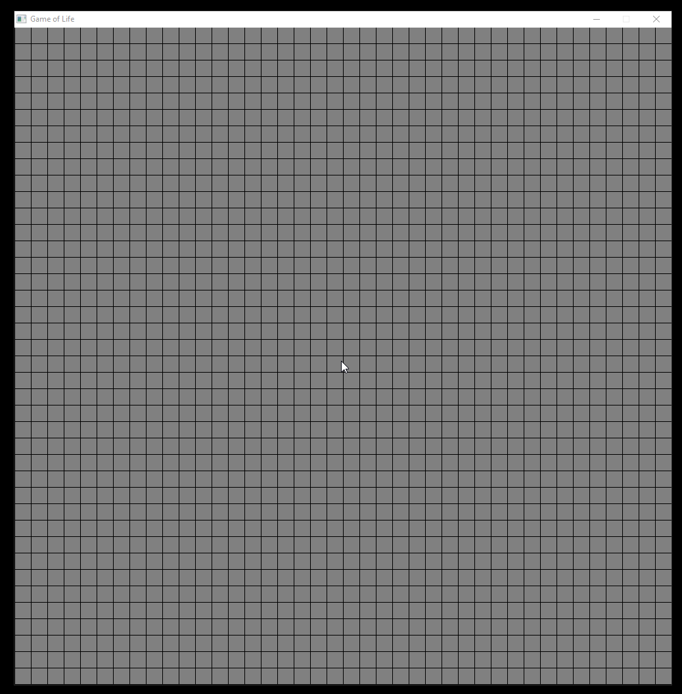

# Game of Life in Ruby

## Controls
* Left Mouse Button: Turn Cells On
* Right Mouse Button: Turn Cells Off
* Right Arrow Key: Step One Generation
* Space Bar (hold): Step generations rapidly

## Credits

Made using [Gosu](https://www.libgosu.org/) gem
